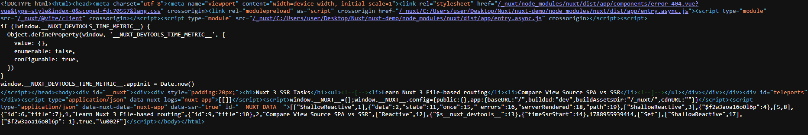
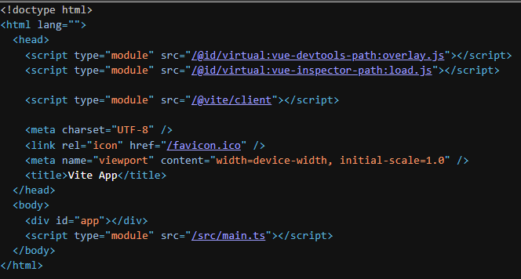

# Исследование: SPA (Vue 3 + Vite) vs SSR (Nuxt 3)

## Результаты экспериментов

1. **View Source**:
   - **SPA**: Отдаёт пустой `

`. Контент появляется только после загрузки бандла.
   - **Nuxt 3**: Отдаёт готовый HTML со всеми тегами и сериализованным `__NUXT_DATA__`.
2. **Hydration Mismatch**:
   - Воспроизведён через `Math.random()`. Продемонстрировал расхождение серверного HTML (`0.0795...`) и клиентского DOM (`0.7078...`).
3. **Server Engine**:
   - Реализован server route `/api/tasks` через Nitro.

## Итоговый вывод

Наш основной проект — закрытая панель управления (Dashboard SPA) с логином и приватными данными.

- Нам не требуется SEO-индексация страниц.
- Использование SSR усложнит инфраструктуру (потребуется Node.js-сервер вместо статического хостинга) и создаст риски ошибок гидратации.

**Решение**: Перевод текущего проекта на Nuxt 3 нецелесообразен. SPA-архитектура полностью закрывает задачи проекта.

